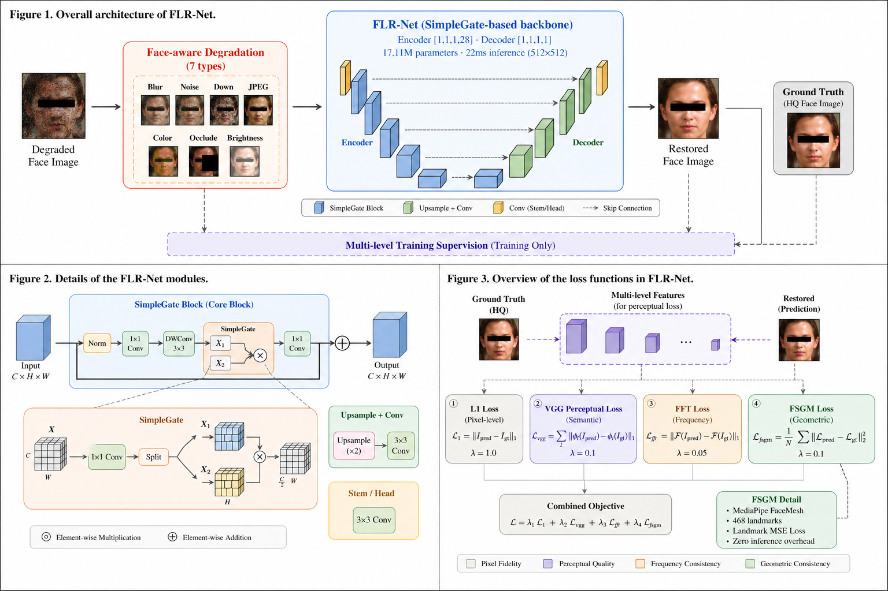
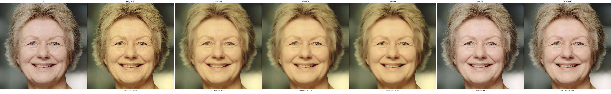
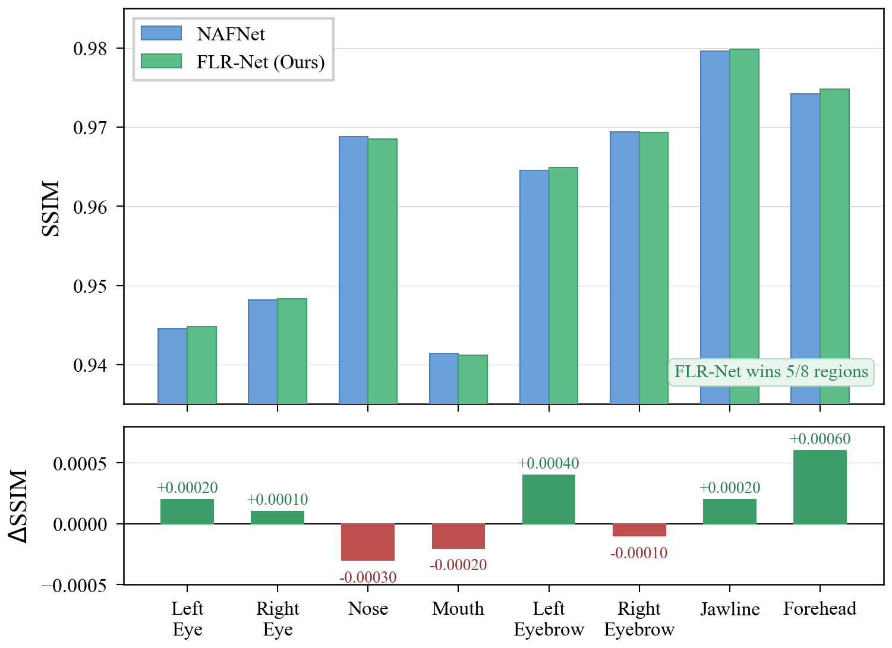
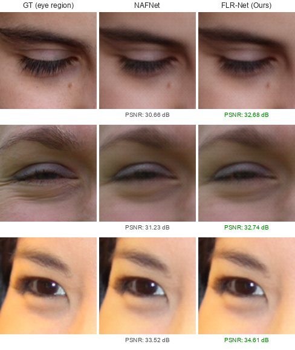
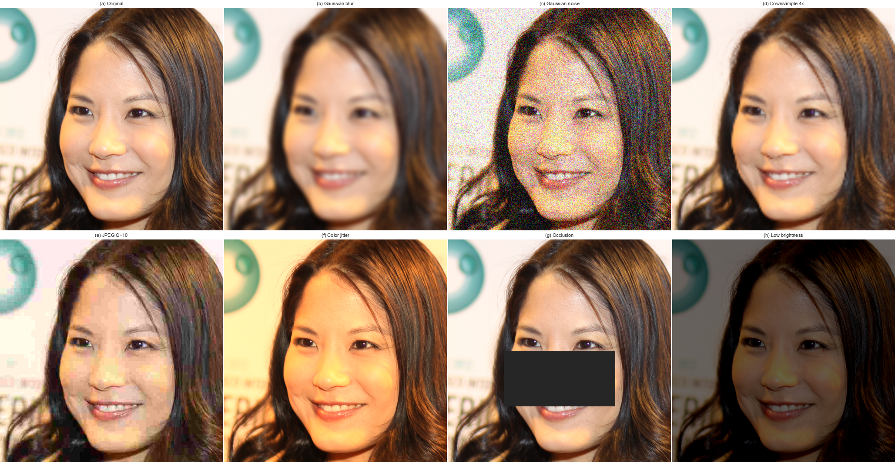

# FLR-Net: Facial Landmark Guided Restoration Network

> **FLR-Net: A Facial Landmark Guided Network for Blind Face Image Restoration in Optical Imaging**

A blind face image restoration framework that integrates a SimpleGate-based backbone, face-aware degradation modeling with 7 degradation types, and a Facial Structure Guidance Module (FSGM) for geometric-level landmark supervision.

---

## Architecture

<p align="center">
  
</p>

FLR-Net consists of three modules:

- **SimpleGate-based Backbone** — Encoder [1,1,1,28] / Decoder [1,1,1,1], 17.11M parameters, 22ms inference.
- **Face-aware Degradation** — 7 types: blur, noise, downsampling, JPEG, color jitter, occlusion, brightness.
- **FSGM** — MediaPipe FaceMesh 468-landmark supervision during training. Zero inference overhead.
---

## Method

### Face-aware Degradation Pipeline

Real-world face images undergo compound degradation from capture to transmission. FLR-Net models this with 7 online degradation types applied with independent probabilities during training:

| Type | Simulates | Probability |
|------|-----------|-------------|
| Gaussian Blur | Camera shake, defocus | 0.7 |
| Gaussian Noise | Low-light sensor noise | 0.5 |
| Downsampling | Cropping and resizing | 0.4 |
| JPEG Compression | Social media sharing | 0.6 |
| Color Jitter | Warm/cool/fluorescent lighting | 0.4 |
| Random Occlusion | Masks, sunglasses, hair | 0.2 |
| Brightness Perturbation | Backlighting, flash, dim environments | 0.4 |

### Four-level Supervision Strategy

FLR-Net supervises restoration from four complementary dimensions:

| Level | Loss | λ | Target |
|-------|------|---|--------|
| Pixel | L1 | 1.0 | Pixel-level accuracy |
| Semantic | VGG Perceptual | 0.1 | Texture naturalness |
| Frequency | FFT | 0.05 | High-frequency detail (edges, textures) |
| Geometric | **FSGM** (Landmark) | 0.1 | Facial structure consistency |

### Facial Structure Guidance Module (FSGM)

FSGM is a structural supervision branch that operates **during training only**:

1. Extract 468 facial landmarks from both predicted and ground truth images using MediaPipe FaceMesh
2. Compute MSE between corresponding landmark coordinates as geometric consistency loss
3. Backpropagate gradients to guide the backbone toward structurally accurate face restoration

At inference, only the SimpleGate backbone runs — **zero additional computational overhead**.

---

## Theoretical Background

### SimpleGate Mechanism

Traditional activation functions (ReLU, GELU) introduce nonlinearity by applying element-wise transformations, but inevitably discard information (e.g., ReLU zeros out all negative values). SimpleGate takes a different approach:

$$\text{SimpleGate}(X) = X_1 \odot X_2, \quad \text{where} \quad X_1, X_2 = \text{Split}(X)$$

The input feature map is split into two halves along the channel dimension and multiplied element-wise. Although each half is linear with respect to the input, their product is **bilinear** — inherently nonlinear. This is analogous to the gating mechanism in LSTMs, where one half controls the information flow of the other, but without the computational overhead of sigmoid activations.

### Why Landmark Supervision Works

Standard pixel-level losses (L1, MSE) treat all spatial locations equally. For a 256×256 face image with ~196K pixels, the eye region occupies fewer than 5% of total pixels. Errors in eye geometry are diluted by the overwhelming majority of background and skin pixels, making them nearly invisible to global losses.

FSGM addresses this by supervising 468 anatomically meaningful points directly:

$$\mathcal{L}_{fsgm} = \frac{1}{N}\sum_{i=1}^{N}\|L_i^{pred} - L_i^{gt}\|^2$$

This creates a **sparse but semantically dense** gradient signal concentrated on facial structures, complementing the dense but semantically uniform signal from L1 loss. The result: the network learns to prioritize geometric accuracy of facial features without sacrificing overall pixel fidelity.

### Training-only Design Rationale

FSGM runs MediaPipe FaceMesh on CPU during training to extract landmarks, which adds computational overhead. However, at inference time, the landmark extractor is completely removed — the backbone has already internalized the structural priors through gradient-based learning. This is conceptually similar to **knowledge distillation**: the landmark detector acts as a "teacher" that guides training, while the lightweight backbone serves as the "student" that deploys independently.

---

## Results

### Multi-method Comparison

<p align="center">
  
</p>

| Method | PSNR (dB) | SSIM | Time (ms) | Params |
|--------|-----------|------|-----------|--------|
| Gaussian Filter | 21.19 | 0.9138 | 0.1 | - |
| Bilateral Filter | 21.01 | 0.9102 | 2.7 | - |
| BM3D | 21.14 | 0.9120 | 327 | - |
| NAFNet | 29.18 | 0.9854 | 22.5 | 17.11M |
| **FLR-Net (Ours)** | **29.16** | **0.9853** | **22** | **17.11M** |

### NAFNet vs FLR-Net

<p align="center">
  
</p>

| Metric | NAFNet | FLR-Net | Winner |
|--------|--------|---------|--------|
| PSNR (dB) ↑ | 29.18 | 29.16 | — (negligible) |
| LPIPS ↓ | 0.1797 | **0.1784** | FLR-Net |
| Win rate (per-image) | 49.5% | **50.5%** | FLR-Net |

### Region SSIM — FLR-Net wins 5/8 regions

<p align="center">
  
</p>

Strongest improvements in eye and eyebrow areas — where landmark density is highest.

### Eye Region Zoom-in

<p align="center">
  
</p>

### Degradation Examples

<p align="center">
  
</p>

---

## Quick Start

### Install

```bash
pip install torch torchvision opencv-python pillow tensorboard mediapipe==0.10.14
```

### Inference

```bash
python compare_single.py --input your_face.jpg
```

### Training

```bash
# NAFNet baseline (7 degradations, no landmark)
python train_7deg.py

# FLR-Net (7 degradations + landmark loss)
python train_flrnet_v2.py

# Resume
python train_flrnet_v2.py --resume
```

### Evaluation

```bash
python evaluate_flrnet_advantage.py
python evaluate_7deg.py
```

---

## Project Structure

```
FLR-Net/
├── models/
│   └── nafnet.py                  # SimpleGate backbone
├── losses/
│   └── losses.py                  # L1 + Perceptual + FFT + Landmark
├── datapipe/
│   ├── degradation.py             # 7-type degradation pipeline
│   └── dataset.py                 # FFHQ loader
├── train_flrnet_v2.py             # FLR-Net training
├── train_7deg.py                  # NAFNet training
├── compare_single.py              # Single image comparison

```

---

## Training Details

| Item | Value |
|------|-------|
| Dataset | FFHQ 52,001 images (512×512) |
| Split | 90% train / 10% test |
| Batch | 8, patch 256×256 |
| Optimizer | AdamW, lr=2e-4 |
| Epochs | 80 |
| Precision | bfloat16 |
| Loss | L1(1.0) + VGG(0.1) + FFT(0.05) + Landmark(0.1) |

---

## Acknowledgements

- [NAFNet](https://github.com/megvii-research/NAFNet) — SimpleGate mechanism
- [FFHQ](https://github.com/NVlabs/ffhq-dataset) — Dataset
- [MediaPipe](https://github.com/google/mediapipe) — Landmark detection

---
## Notice
All figures and images in this repository are original works of the author(s). **Reproduction, redistribution, or reuse of any figures without explicit written permission is strictly prohibited.** This includes but is not limited to the architecture diagrams, result comparisons, and evaluation charts in the `paper_figures/` directory.